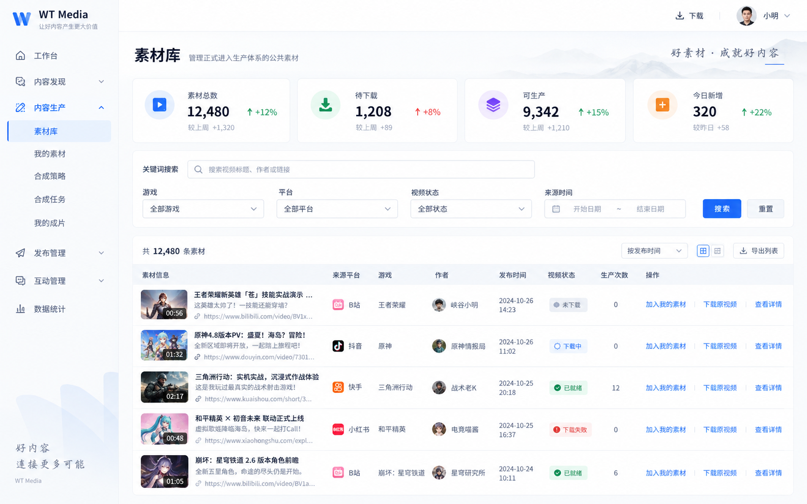
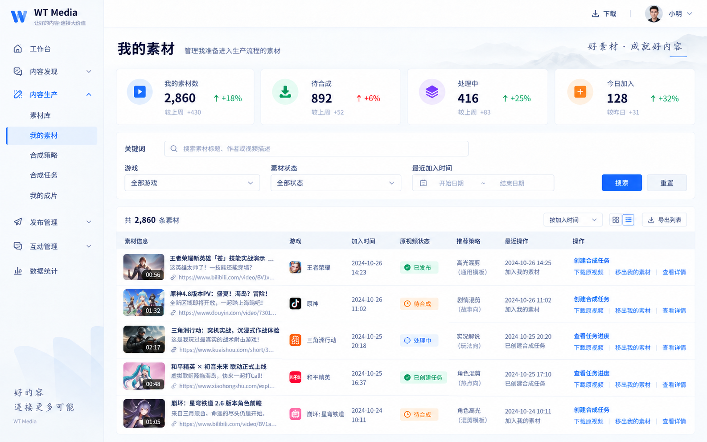
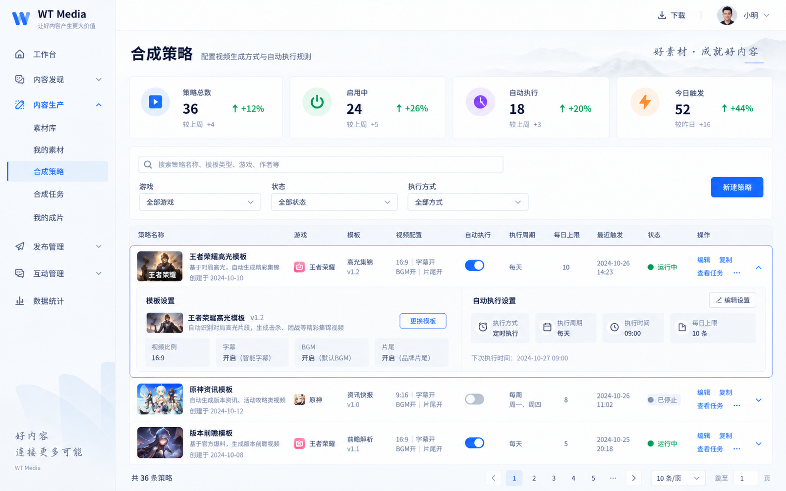
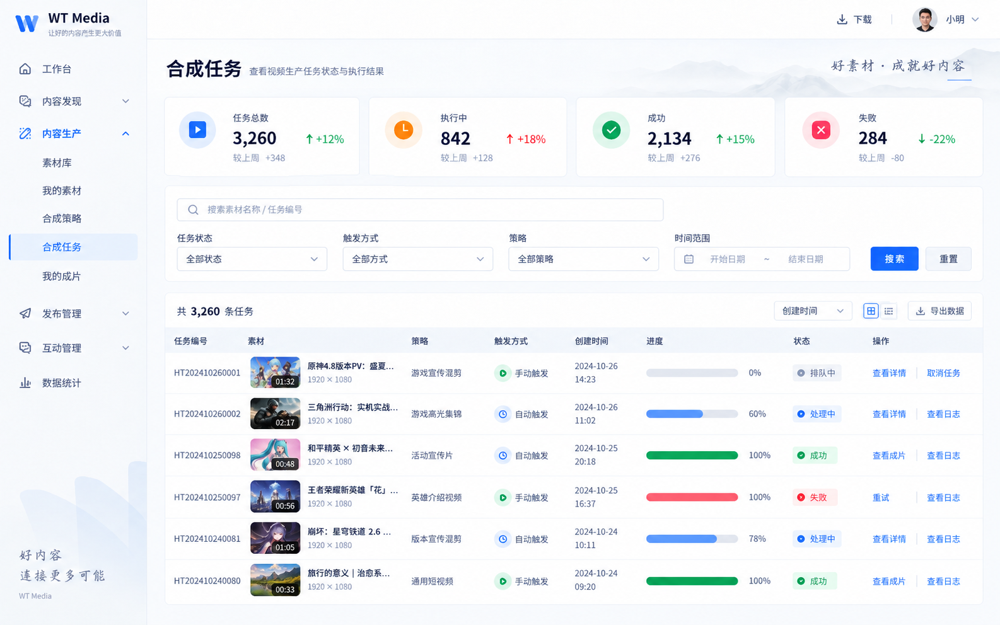
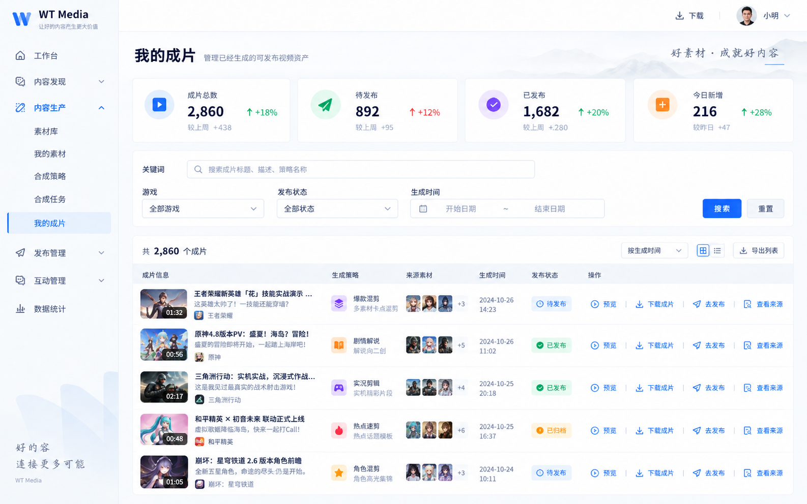
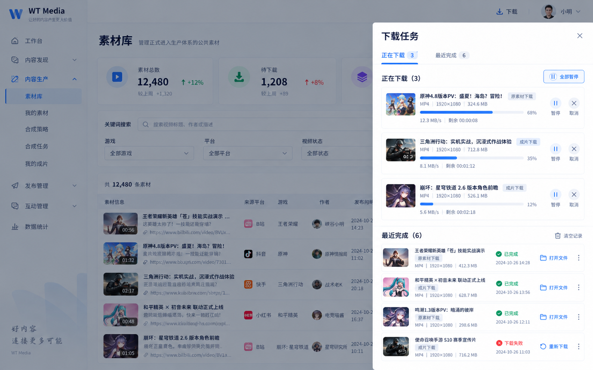

# M4-M5 内容生产 UI 参考

> 更新日期：2026-09-24
> 性质：界面视觉参考资产索引，不是产品需求或工程设计事实源。

本目录保存 M4-M5 内容生产调整所使用的六张界面参考图。权威产品需求、工程边界、里程碑和变更记录位于兄弟仓库 `../wt-media-workspace`；运行时实现不得仅根据图片中的演示数据、示例文案或临时状态推导业务规则。

稳定事实入口：

- 产品：`../wt-media-workspace/docs/product/prd/详细文档/第五章_素材生产.md`
- 工程：`../wt-media-workspace/docs/engineering/specs/2026-09-24-m4-m5-cloud-content-production.md`
- 决策：`../wt-media-workspace/docs/decisions/0017-m4-m5-cloud-owned-content-production.md`
- M4：`../wt-media-workspace/delivery/milestones/M4-content-production.md`
- M5：`../wt-media-workspace/delivery/milestones/M5-automatic-production.md`

## 1. 素材库

## 2. 我的素材

## 3. 合成策略

## 4. 合成任务

## 5. 我的成片

## 6. 下载中心

## 原始文件校验值

| 文件 | SHA-256 |
| --- | --- |
| `01-material-library.png` | `a54339c2acbf3d739ec65d3675fc05d9f8ef56a1f45cabe21a04c14312a22e3c` |
| `02-my-materials.png` | `ec2209ab5cffe831b2e76afd251444eaa81127da6861fb36e6c5bfcf020d0d47` |
| `03-compose-strategies.png` | `31ce7c9b5c45e8dcc5d564d36987d35e8272dad5320b412333883ae0dbbdc4c7` |
| `04-compose-tasks.png` | `df19ad27726fffe6ee26dcc2d71d9c4208532ff1a8edc067bd4b9fa6db647ee8` |
| `05-my-outputs.png` | `b8c3c934f8a827f6cc9c664508e133988e933d16ebea16a3feaaf854686541f8` |
| `06-download-center.png` | `abd3cc90004795a89ea6ad869a2b2f70b647934ec45013ddf3091f7d0db3a685` |
